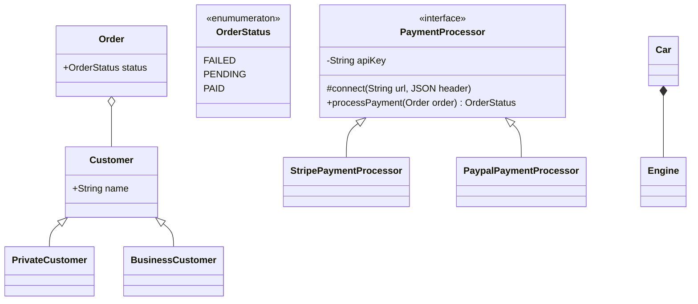

# Mermaid Tutorial
## Class diagrams

- Symbols for access settings
    - "-" means it's private
    - "#" means it's protected
    - "+" means it's public

 

- Relationships
    - Inheritance "<|--"
    - Association
        - Composition "*--"
            - The child exists because it's dependent of its parent
        - Aggregation "o--"
            - The child can exist independently from its parent