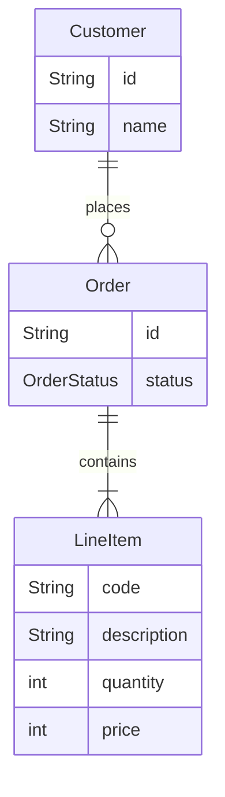

# Mermaid Tutorial
## Entity Relationship Diagram

```mermaid
erDiagram
    Customer ||--o{ Order: places
    Order ||--|{ LineItem : contains
    Customer {
        String id
        String name
    }
    Order {
        String id
        OrderStatus status
    }
    LineItem {
        String code
        String description
        int quantity
        int price
    }
```