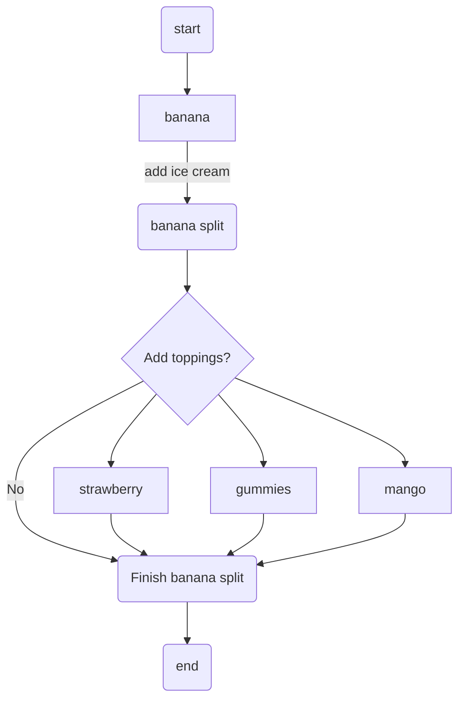
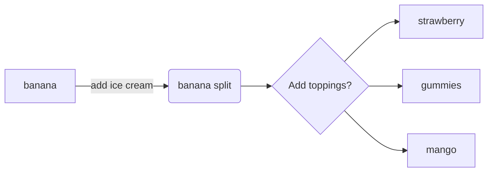
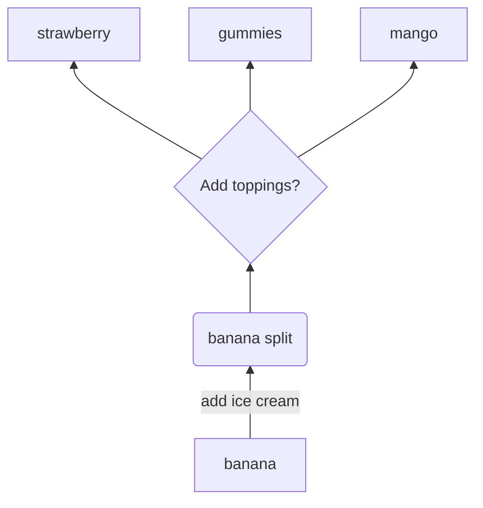

# Mermaid tutorial
## examples

```mermaid
flowchart
S(start) --> A
A[banana] -->|add ice cream| B(banana split)
B --> C{Add toppings?}
C --> D[strawberry]
C --> E[gummies]
C --> F[mango]
C -->|No| G(finish banana)
D --> G(Finish banana split)
E --> G(Finish banana split)
F --> G(Finish banana split)
G --> H(end)
```

```mermaid
flowchart LR
A[banana] -->|add ice cream| B(banana split)
B --> C{Add toppings?}
C --> D[strawberry]
C --> E[gummies]
C --> F[mango]
```

```mermaid
flowchart BT
A[banana] -->|add ice cream| B(banana split)
B --> C{Add toppings?}
C --> D[strawberry]
C --> E[gummies]
C --> F[mango]
```