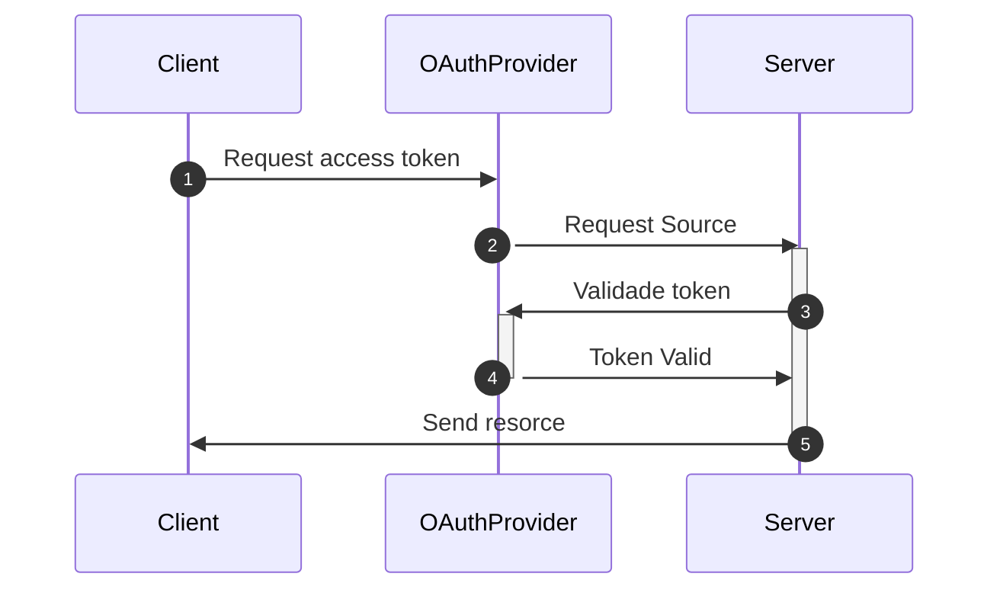

# Mermaid Tutorial
## Sequence Diagram

```mermaid
sequenceDiagram
    autonumber
    participant Client
    participant OAuthProvider
    participant Server
    Client ->> OAuthProvider : Request access token
    activate OAuthProvider
    OAuthProvider ->> Server : Request Source
    activate Server
    Server ->> OAuthProvider : Validade token
    activate OAuthProvider
    OAuthProvider ->> Server : Token Valid
    deactivate OAuthProvider
    Server ->> Client : Send resorce
    deactivate Server
```